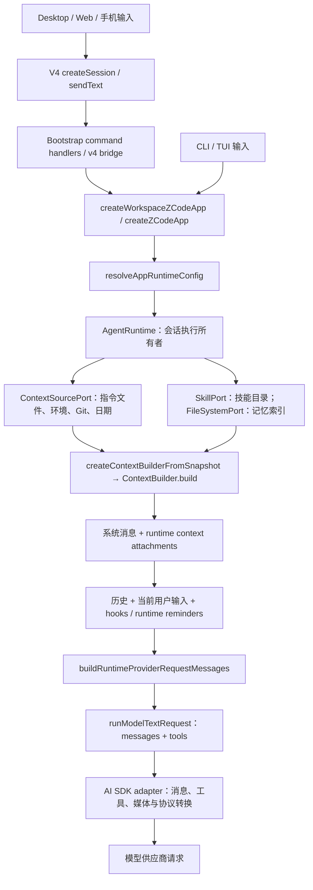
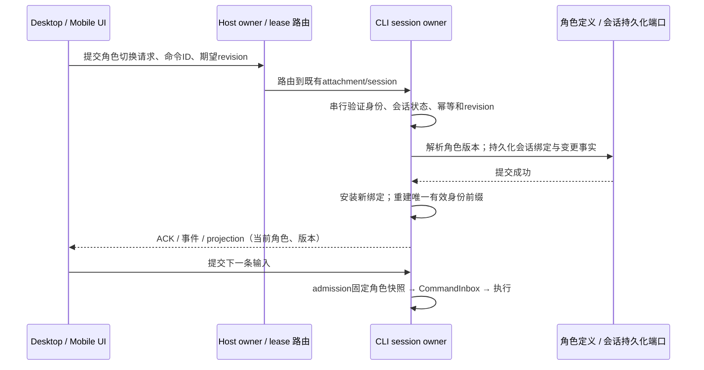

# ZCode 提示词链路与动态角色设计调查

调查日期：2026-09-30。源码基线：`29628c9`，分支 `codex/cycbyYou`，基线检查与 `origin/main` 无差异。

本文是源码调查和设计建议，不是已实现功能或已批准的产品 spec。未修改业务代码。实现角色管理前，需将确认的产品规则落到正式 spec。

## 1. 结论

ZCode 的最终模型输入不是一份 system prompt 文件，而是 Core 组装的系统消息、用户上下文附件、对话历史、当轮提醒和独立工具契约。

主会话具有内部 `AgentRuntimeConfig.systemPrompt` 替换入口，但替换并不完整：它保留 `You are ZCode, an interactive coding agent`，同时跳过默认身份、Harness、Desktop 展示约定、动态行为、记忆使用说明、环境和上下文管理等系统段。Skills 目录、AGENTS.md、项目记忆索引、日期仍可注入；工具注册和当轮 runtime 提醒也不会因此消失。

因此，“角色 = 主身份与性格的替换”需要成为 ContextBuilder 的显式产品语义。不能直接把角色管理接到现有 custom prompt，也不能只追加一句“现在扮演某人”。需要拆开可替换身份与运行约定，替换旧身份，并清理默认行为中的 coding 预设。

## 2. 从客户端到模型的链路



关键证据路径，均为仓库相对路径：

| 阶段 | 当前文件 / 符号 | 职责 |
| --- | --- | --- |
| 会话创建与提交 | `packages/shared/src/zcode-protocol-v4/command.ts` | createSession、sendText 等运行时 schema；当前没有 role 字段或角色切换命令 |
| V4 命令入口 | `apps/zcode-cli/packages/bootstrap/src/zcode-protocol-v4/commands/handlers/session-mgmt.ts`、`session-flow.ts` | 创建会话、输入 admission、queue/guide 路由 |
| 创建 runtime | `apps/zcode-cli/packages/bootstrap/src/zcode-protocol/server-operations.ts`：materializeSessionRecord | 将模式、工具面、工作区等传到 app；当前没有主角色注入 |
| 展示平台 | `apps/zcode-cli/packages/bootstrap/src/zcode-protocol-entrypoint.ts`：applyProtocolPresentationSurface | 注入 terminal / zcode_desktop 的展示表面 |
| 配置解析 | `apps/zcode-cli/packages/bootstrap/src/app/runtime-config.ts`：resolveAppRuntimeConfig | 合成 runtimeConfig，默认启用工作区指令发现；保留调用方传入的内部 systemPrompt |
| Runtime 初始化 | `apps/zcode-cli/packages/bootstrap/src/app/create-app.ts` | 创建 AgentRuntime、ContextSourcePort 等依赖 |
| 收集与组装 | `apps/zcode-cli/packages/core/src/runtime/methods/context.ts` | 首次加载指令、技能、记忆；将 config.systemPrompt 映射成 customSystemPrompt |
| 提示词正文 | `apps/zcode-cli/packages/core/src/context/builder.ts` | 选择默认 / custom / workflow actor 路径，组装 section 和消息 |
| 历史安装 | `apps/zcode-cli/packages/core/src/runtime/methods/context-history-entries.ts` | systemMessages 与 metaUserAttachments 进入运行时历史 |
| 请求时提醒 | `apps/zcode-cli/packages/core/src/runtime/methods/turn-loop.ts` | 按条件增加模式、Todo、输出样式提醒，读取实际可用工具 |
| Provider 投影 | `apps/zcode-cli/packages/core/src/runtime/helpers/provider-request-messages.ts` | 整理 attachment 顺序、包装 reminder、去掉 runtime 元数据、处理缓存锚点 |
| 发送模型请求 | `apps/zcode-cli/packages/core/src/runtime/methods/model.ts`：runModelTextRequest | 媒体投影后调用 Model.generateText / streamText，工具独立传递 |
| 协议序列化 | `apps/zcode-cli/packages/adapters/src/model/runner-options.ts`、`transform.ts` | toAiSdkMessages / toAiSdkTools → AI SDK 请求 |

Renderer 不拥有最终 system prompt。Host/Main 的传输和路由职责也不是角色身份的权威所有者。

## 3. 默认主会话提示词的实际构成

ContextBuilder 的 section 顺序与最终消息块不是一一对应关系。它先按 system/meta_user 和 stable/dynamic 分类，再聚合 system 消息。

### 3.1 默认 system 消息

| 最终块 | 组成 | 来源 |
| --- | --- | --- |
| system 1：产品前缀 | `You are ZCode, an interactive coding agent` | `context/sections/cli-prefix.ts` |
| system 2：稳定正文 | 软件工程助手身份 + 安全说明 + Harness；Desktop 表面还含 Desktop 展示约定 | `sections/identity.ts`、`sections/desktop.ts` |
| system 3：动态正文 | 沟通与行为规则、按工具生成的 session guidance、Memory、Environment、可选 Output Style、Context Management、可选 Git 快照 | `context/dynamic-sections.ts`、`sections/memory.ts`、`sections/env-info.ts` |

Desktop 展示约定虽然在 builder 的“动态上下文”构建阶段加入，但其 `cacheHint` 是 stable，所以进入 system 2。默认路径的三个 system 消息都携带 ephemeral 缓存提示。

细节：

- Session guidance 当前仅在有 Skill 工具且有技能时产生有效说明；不能将已注释掉的 Agent/AskUserQuestion 指导视为当前功能。
- Git 是会话开始时的快照，正文明确说明不会随会话实时更新。
- Environment 中的模型名称取自该步骤实际 Model，不取历史环境快照中的模型字段。
- ProjectContext 会被探测并传入 builder，但当前 build 没有将它作为独立 section 展开。
- `ContextBuilder.addSection()` 是扩展入口，本轮对当前 packages 源码搜索未发现业务调用；它不代表已有角色注入功能。

### 3.2 meta_user 上下文

| 来源 | 实际内容 | 最终含义 |
| --- | --- | --- |
| skills_listing | 技能名称、描述、文件路径；不是所有 SKILL.md 全文 | 可用能力目录，具体技能执行时再加载内容 |
| context_prefix | AGENTS.md 指令、启用时的项目 MEMORY.md 索引、日期 | 请求级上下文附件 |

`context/sections/request-user-context.ts` 将用户默认指令、工作区指令、记忆索引合成一个上下文正文；`current-date.ts` 再提供日期。Core 存储的是带来源标记的 attachment，provider 投影时才处理模型可见的 role 和 `<system-reminder>` 包装。

`<system-reminder>` 是文本标签，不是供应商 API 中的独立权限层。其 role 要看投影结果，不能看到标签就认定它是 system 消息。

### 3.3 AGENTS.md 从哪里读

`apps/zcode-cli/packages/adapters/src/context/index.ts` 的 NodeContextSourceAdapter：

1. 读取用户目录下 `.zcode/AGENTS.md`（存在时）。
2. 从 workingDirectory 向上寻找工作区指令，找到第一个匹配文件即停止；到 projectRoot / 文件系统根停止。
3. 默认候选文件仅 `AGENTS.md`；每个文件默认最多读取 100 KiB。
4. 用户默认指令在前、工作区指令在后，并去重相同文件。

这不是“自动将所有祖先和子目录 AGENTS.md 递归叠加”。ContextBuilder 文本声明这些指令覆盖默认行为，因此它们也是可能重新带入 coding 规则的独立来源。

### 3.4 Memory 从哪里读

`core/src/memory/project-root.ts` 以 workspaceIdentity 优先、workspacePath fallback 构造工作区记忆目录；`runtime/helpers/project-memory.ts` 控制启用和 taskType 条件。

当前是工作区维度的记忆，不含 roleId。相同工作区中的两个角色不会仅因角色不同而自动获得独立记忆。Memory 使用说明位于 system 动态段，MEMORY.md 索引内容则位于 meta_user；custom prompt 只会去掉前者，不能据此推断记忆已关闭。独立的 memory extraction 路径也应在后续改造中审查。

### 3.5 运行中的其他输入

`runtime/methods/hooks.ts` 接收 SessionStart / UserPromptSubmit 等 hook 的 additionalContexts；`system-reminder/source.ts` 定义来源、生命周期和投递语义。它们不全部来自 ContextBuilder。

典型来源包括 runtime_mode、plan_mode_exit、output_style、todo_reminder、hook_context、prompt_attachment、date_change、goal_state_change、incoming_message、queued_system_notification、恢复与分叉提示。具体来源按条件出现，不能把整个清单理解为每次都注入。

模式切换、权限、工具结果与目标状态等信息属于执行事实。角色 prompt 的替换不应清除这些事实，也不自动改变工具权限。

## 4. 最终交给模型是什么

不使用 mid-conversation system 投影时，默认 Desktop 首轮的概念结构为：

```text
messages = [
  system(product prefix),
  system(identity + Harness + Desktop presentation contract),
  system(dynamic behavior + memory guide + environment + ...),
  user(<system-reminder>skills listing</system-reminder>),
  user(<system-reminder>AGENTS + MEMORY index + date</system-reminder>),
  ...conversation history,
  user(actual user text / attachments),
  ...conditional current-turn reminders
]
tools = [ { name, description, inputSchema, ... }, ... ]
```

这只是示意。附件会按因果边界重排；支持 MCS 的模型或 force 模式可将符合位置要求的提醒变为中途 system，非法位置则回落到 user reminder。实际序列必须以 provider 投影结果为准。

工具名称、描述和参数 schema 走请求的独立 tools 字段，不再复制到 system prompt。改变角色文本不会自动移除 Bash、文件编辑、MCP 等能力，权限仍由工具面和权限系统处理。

供应商边界：

- `providerKind === openai-compatible` 时，`adapters/src/model/system-message-compat.ts` 按原序连接连续的开头 system，适配只允许单个开头 system 的模板；adapter 不自动添加分隔符，各段自带左边界。
- Anthropic 的 wire shape 把 system 内容放到顶层 system，并可能合并相邻 user 内容；缓存提示随转换映射。仓库的 prompt-trajectory 工具文档和派生逻辑描述了这种投影。本轮没有发送真实 Anthropic 请求。
- 其他协议应依据当前 adapter/SDK 的实际输出检查，不能将某一个供应商的 JSON 当作通用形态。

主会话、子会话、标题生成、compact 总结、目标完成校验和 workspace generateText 并非共用一份人物 prompt。角色管理首先应界定“影响面向用户的主会话”，其他内部任务 prompt 的继承规则要分别确定。

## 5. 现有替换机制对比

| 入口 | 当前效果 | 是否可直接承担主角色切换 |
| --- | --- | --- |
| `AgentRuntimeConfig.systemPrompt` → customSystemPrompt | 替换默认体系的主体并跳过默认 system 上下文；仍保留 coding 前缀、meta_user 和 runtime 提醒 | 不完整；还没有公开的主会话动态切换契约 |
| `outputStyle` | 改写默认身份介绍，增加 Output Style 段和当轮提醒；仍保留 coding 前缀与默认行为 | 不能作为彻底的身份替换 |
| Settings 中的 Subagents | 管理 agent Markdown/profile；调用 Agent 时创建带 agentPrompt 的子 runtime | 管理的是被委派子代理，不是当前主会话身份 |
| `workflowActor.persona` | 给工作流子代理加入 persona；去掉交互 coding 前缀，保留脚本工作契约 | 是身份分层的参考；其读者是脚本，不能直接用作对话人物 |
| AGENTS.md / Skill / 普通用户消息 | 注入上下文和局部规则 | 不能确保旧身份段被替换 |

其他已确认边界：

- `customSystemPrompt` 与 `workflowActor` 同时存在时，builder 明确抛错。
- `keepCodingInstructions` 出现在 OutputStylePromptConfig 类型中，但当前身份、动态行为构建没有读取它；设置 false 不会清除 coding 行为。
- `runtime/methods/config.ts` 的 updateConfig 只接受 mode、planEnabled、language、outputStyle，没有 systemPrompt 动态更新能力。
- V4 的 command / session-config schema 当前没有 role 选择状态。现有模型/模式切换不能被当成已支持角色切换。

## 6. 历史、恢复与 compact 的影响

`runtime/methods/context-refresh.ts` 的 rebuildContextPrefix 已能重新构造上下文前缀，并保留后面的 conversation entries。这是后续“替换当前有效身份”的可复用机制；但不能直接暴露它为 UI 状态写入口。

`runtime/methods/turn.ts` 会在执行开始冻结部分本轮配置，之后初始化或重建前缀。`turn-guide-drain.ts` 在特定 guide 切模路径也可能重建前缀。因此角色不能只写进一个可变全局 config：本轮身份、排队输入身份和会话当前选择必须分别定义。

`runtime/methods/resume.ts` 冷恢复先重新初始化上下文，再 hydrate 历史；目前没有 role binding / role revision 的恢复逻辑。消息的 `system` 字段记录内部 config.systemPrompt，不是完整最终请求，也不是现成的角色版本管理。

`runtime/helpers/compact.ts` 保留上下文前缀，再接 compact summary 等内容。`core/src/compact/prompt.ts` 当前强调代码、文件、架构和错误，带有明显 coding 倾向。面向数字人的默认摘要策略也应调整，否则长对话仍可能被工程任务视角整理。

即便干净替换 system 身份，旧 assistant 发言、用户角色指令和摘要仍会留在历史中。继续同一会话表示“新角色接手历史”，不等于“从未出现过旧角色”。需要纯净人格上下文时，应创建新会话。

## 7. 角色管理的建议边界（待产品确认）

### 7.1 Prompt 的目标分层

```text
运行约定：工具调用、权限、真实结果、平台展示、上下文连续性
    +
当前角色身份：名字、背景、价值倾向、性格、关系定位、沟通形式
    +
能力与当前环境：实际工具/技能、日期、工作环境、记忆
    +
用户指令、对话历史与当前输入
```

“切换角色”的精确定义建议为：替换当前唯一的角色身份段，并删除被替代的默认 coding 身份和相关默认沟通预设。运行约定独立维护；人物可改说话风格，不能用 prompt 冒充权限配置或清除真实任务状态。

建议保留一种默认通用数字助手角色。现有 coding 工作方式可作为角色/能力组合另行保留，但是否在产品中提供该预设由产品决定；它不应继续作为所有人物的隐含默认身份。

### 7.2 最小角色数据

以下名称仅为候选契约，不表示仓库已有类型或命令：

```ts
type RoleDefinition = {
  id: string;
  name: string;
  description: string;
  avatar?: string;
  revision: number;
  personaPrompt: string;
};

type SessionRoleBinding = {
  roleId: string;
  roleRevision: number;
  roleName: string;
  personaPromptSnapshot: string;
};
```

初版用一段可编辑的 personaPrompt 作为性格与形式的唯一事实来源。结构化性格表单可晚些增加；若增加，应编译成同一份正文，避免表单与自由 prompt 各维护一份规则。

角色定义带版本；会话绑定已解析的版本/内容快照。编辑角色库不应悄悄改变运行中的会话。已被会话引用的角色若删除/归档，历史绑定仍需可恢复；不应静默换回其他人物。

模型、工具许可与角色性格初版分别管理，避免角色切换隐式切模、扩大权限或重启 runtime。

### 7.3 状态所有者

| 状态 | 建议权威所有者 | UI 的职责 |
| --- | --- | --- |
| 角色库定义与版本 | 明确存储作用域的角色库服务，通过服务/adapter 异步读写 | 列表、编辑草稿、验证错误 |
| 新会话角色选择 | 提交前是 UI draft；创建成功后成为 session runtime 的绑定 | 草稿选择与创建请求 |
| 已存在会话的角色 | CLI/runtime session owner；通过命令提交、持久化并下发 projection | 发切换请求并显示确认后的状态 |
| 已接纳输入的身份 | CommandInbox admission 时固定的 role binding | 只显示 pending optimistic 状态 |
| 已开始执行的身份 | active turn 中的不可变角色快照 | 显示本轮实际人物 |
| 角色记忆 | 后续单独定义的记忆所有者 | 显示作用域，不能用本地 UI 缓存代表服务端记忆 |

角色库的存储作用域必须显式选择：客户端用户全局、执行环境级或工作区级。目前仅有 Subagents 存储实现可参考，不能由“多个界面共用组件”推断角色库自动跨 Host/机器可用。

### 7.4 建议的切换规则

初版建议会话级选择，角色库可以复用：

- 新会话在首条输入前绑定角色。
- idle 会话可切换，保留历史，并明确提示“新角色接手当前对话”。
- 初版 running / 有已接受待执行输入时拒绝切换并说明状态，避免引入隐式中途人格变化。若后续产品需要“下一轮生效”，应设计显式 pendingRole 和生效事件。
- 每条输入在服务端 admission 固定角色版本；执行与重试读取该事实。不能按执行时最新的角色库重新解析。
- 编辑角色库不会自动影响已绑定会话；用户显式应用新版本才变更绑定。
- 同一角色的同版本切换是幂等 noop；不存在的角色/版本、空 prompt、过期 revision 返回明确错误。
- 冷恢复、fork、retry、compact 需要保留可解释的角色版本。是否 retry 用原轮身份、fork 用边界身份，需在 spec 中确定；建议保留原执行身份。



该图是设计建议。持久化失败不能返回切换成功；并发切换要复用命令幂等/revision 机制，不用超时猜测同步完成。Main、relay 仍只处理转发与 attachment 调度。

### 7.5 建议 UI

| 场景 | 入口建议 | 生效范围 |
| --- | --- | --- |
| 管理人物 | 设置中的“角色管理”：列表、创建、编辑、复制、归档、prompt 预览 | 角色库 |
| 新建对话 | 输入区附近角色选择器；显示当前人物与描述 | 当前待创建会话 |
| 已有对话 | 对话顶部当前角色、切换操作 | 指定 session |
| 手机远控 | 使用同一会话 projection 与切换命令 | 桌面现有 Host attachment 的会话 |

复用 DESIGN.md 的排版、组件、主题和国际化要求。角色不能只显示一个头像而让用户无法知道当前实际生效版本。建议提供“查看生效提示词组成”，区分角色正文与运行约定，便于发现身份残留。

### 7.6 仍需确定的产品问题

1. **切换历史**：同会话接手历史，还是选择人物即进入该人物的独立对话？建议同时提供“当前会话切换”与“以此角色新建对话”，不要混同。
2. **记忆**：不同角色共享对用户的认识，还是各有独立关系记忆？当前实现只有工作区记忆。角色独立记忆建议后续分开设计，同时保留可共享用户偏好。
3. **角色库作用域**：全局人物库如何在本地、SSH/WSL/容器和手机远控之间解析？必须通过既有 workspaceIdentity / remoteSessionId / owner 路由明确来源。
4. **busy 切换**：接受初版 busy 拒绝，还是要求下一轮生效？若下一轮生效，需要明确已接纳 queue/guide 与切换事件的先后关系。

这些问题不会阻碍本轮提示词调查；会改变正式 spec 和实现范围。

## 8. 实施影响与验收建议

必须检查：Core ContextBuilder / runtime、V4 schema 和投影、角色服务/存储、UI hooks/选择入口。其次检查：恢复/compact/fork/retry、memory extraction、子代理继承。工具权限、owner/lease、身份隔离、两种交付语义属于必须保留的边界。

建议正式 spec 包含以下验收场景，本轮未将它们作为已有测试覆盖：

| 场景 | 断言 / 证据 |
| --- | --- |
| 默认数字助手 | 最终 provider 可见 system 不包含默认 coding 身份；运行约定存在 |
| 角色 A → B | 只有 B 是当前有效身份；A 的既有历史发言不被伪装删除 |
| 两会话不同人物 | 改变一会话不影响另一会话 |
| running / 已入队输入 | 按选定 busy 规则处理；已经 admission 的身份不被后续编辑污染 |
| 编辑 / 归档角色 | 活动与冷恢复会话仍能解析原绑定；应用新版本是显式操作 |
| 重启 / fork / retry / compact | 角色版本、摘要和执行身份符合确定的规则 |
| Desktop 与手机并发切换 | revision/幂等拒绝 stale 命令；两端收敛到同一个事实 |
| 本地与远程同路径 | workspaceIdentity 不混淆；remoteSessionId 不丢失 |
| OpenAI-compatible 与 Anthropic | 验证最终序列化后的身份、role 顺序、工具结果与缓存提示 |
| 无效角色 / 持久化失败 | UI 不显示成功；旧绑定保持一致；错误可解释 |

当前 feature-boundary seed graph 有 Subagents 与会话节点，没有主动态角色能力节点。此项为 `graph-drift-candidate`；本轮 impact-only 不修改图。实施前需新增经源码验证的角色节点与边界。

## 9. 本轮验证及证据限制

- 基线检查：成功，`ahead 0 / behind 0`；工作区初始无本地修改。
- 用当前源码的 ContextBuilder、context-history-entries、provider projection 与 OpenAI-compatible system normalizer，在本地执行四组虚构输入：默认 Desktop、custom persona、output style（keepCodingInstructions=false）、workflow actor。未调用真实模型或读取用户会话内容。
- 四组结果分别确认默认三段 system、custom 残留前缀且跳过默认系统段、output style 不清除 coding 规则、workflow actor 走独立身份；另确认 custom/workflow 互斥会抛错。
- 当前 core package.json 没有 test 脚本；本轮是本地组装验证，不声称执行了仓库单测或 E2E。
- `pnpm typecheck` / `pnpm lint` 已尝试，系统 pnpm 为 11.14.0，仓库固定为 10.33.2；pnpm 启动尝试下载固定版本，因 registry fetch failed 未进入检查。环境 Node 为 24.18.0，mise.toml 固定 24.14.0，未发现可用 mise 命令。
- 补充直接执行工作区已安装的 root script 对应命令：`node_modules/.bin/tsc.cmd -b packages/rpc packages/provider packages/provider-node packages/shared packages/services packages/client packages/server packages/zcode-server-cli packages/ui packages/web packages/desktop/tsconfig.host.json` 退出码 0；`node_modules/.bin/oxlint.cmd` 退出码 0，70 条现有警告、0 错误。不是固定 mise 工具链的通过证据。
- 本轮未验证真实供应商响应的人物表现、Electron / 手机 UI、持久化切换或不同操作系统；这些目前是待实现能力。

实际模型请求可用现有 `apps/zcode-cli/tools/prompt-trajectory/README.md` 中的 record / model-io 路径观察。model-io 中原始 messages 与最终 wire body 不应混为一谈；应查看转换后的 request body。本轮虚构快照仅证明被执行的组装与投影逻辑。
