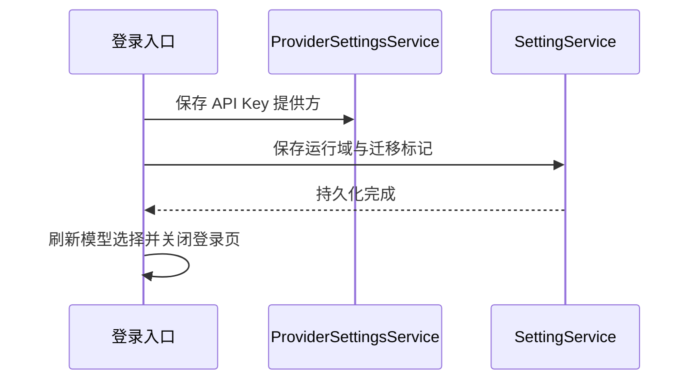

# API Key 登录与启动恢复

SettingService 是提供方运行域的唯一持久化所有者。API Key 登录按顺序创建 Personal Provider、保存所选运行域与迁移标记、刷新模型选择、发布登录成功事件并关闭登录入口；设置写入失败时保留错误提示，不发布成功事件。

旧版本已保存有效非空 API Key、但没有运行域且未完成迁移时，复用启动迁移入口：模型选择视图无法推断时，通过 ProviderSettingsService 的设置视图，仅从启用且有非空 API Key 的提供方模板推断。只有唯一的 Z.ai 或 BigModel family 才自动恢复；无配置、空 key、禁用或多个 family 不擅自选择。已有运行域或已完成迁移的设置保持原语义。迁移后先刷新设置和模型状态，再解除启动门禁，避免使用旧的空运行域。

验收：两种 family 登录后运行域持久化；重启复用已有 Key；旧版单 family 配置可恢复；多 family、禁用和空 key 不错误迁移；实际安装后连续两次启动不出现登录入口。

## 验证记录（2026-10-01）

- 7 个回归测试通过；typecheck 通过；lint 0 errors、71 warnings；架构检查 0 violations。
- 新包覆盖安装到 `D:\SOFTWARE\dexcode`，安装退出码 0，已安装 `app.asar` 与新构建哈希一致。
- 使用现有配置连续两次启动，登录入口均未出现；运行域恢复为 `bigmodel`，迁移标记为 true，界面显示 BigModel Coding Plan/GLM-5.3。
- 升级前后 `provider_config.json` 哈希一致，未重新写入或丢失 API Key；官方协议仍指向官方 ZCode。
- 此次验证登录恢复与启动，不包含实际模型生成请求。
