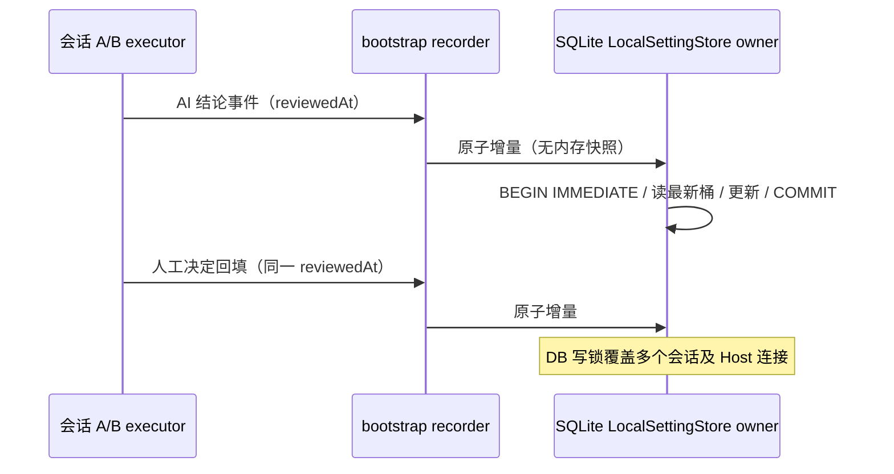

# 自动审核模式

## 模式语义（2026-10-03）

自动审核是第五档协作模式，内部值 `review`，界面文案「自动审核」（en: "Review automatically"）。语义为完全访问（yolo）基线之上，非只读的工具操作先经一次 AI 校验：校验通过直接执行，不再追加普通人工确认；校验不通过、模型调用失败或超时，一律复用现有权限确认链路暂停等待用户决定。工具声明的强制交互（AskUserQuestion、alwaysAsk）、项目禁止/确认规则及计划模式约束保持现有优先级。需求澄清不进入 AI 操作审核，也不由 AI 代替用户回答。审核意见通过现有 reason 文本携带。

权限服务仍是工具调用裁决的唯一所有者；AI 审核器是权限裁决在 review 模式下的协作组件，不新增独立业务状态所有者。「非只读」判定以归一化 capability 的 `sideEffectScope === "none"` 为免审线，数据来自工具注册的权限元数据，属确定性判断，不调用模型；Bash 沿用现有命令级只读解析（`git status` 等纯读命令免审，写类命令进审核）。`WebFetch` 等声明 readOnly 但副作用域为 network/system 的操作计入审核范围。用户在确认弹窗选择允许后，同一操作签名（工具名 + 参数哈希）在本次会话内不再重复审核与询问；会话结束失效，不落盘。

第一版仅在交互会话提供该模式：composer 模式下拉、CLI `--mode` 与会话配置可携带；定时任务、闲时任务表单值域不加入，automation 链路收到 review 值按遗留 `autoEdit` 同路径降级为 build。

## 状态所有者与接口

- 模式枚举同步扩展七处：`zcodeSessionModeSchema`（legacy 协议）、`ZCodeTaskMode` 与其 zod schema、`submissionModeSchema`（v4）、`executionPermissionModeSchema` 与 `resolveExecutionState`、`CliPermissionMode` 与 `--mode` 校验、bootstrap `SWITCHABLE_MODES`、services `toZCodeMode`/`fromZCodeMode` 与 `sessionModeOptions` canonical 集合。
- 裁决分支：permission/service 新增 `checkReviewMode`，与 `checkEditMode` 并列。只读放行 rule `mode.review.readOnly`；审核通过放行 rule `mode.review.aiApproved`；审核不通过或不可用转为现有确认请求，rule `mode.review.aiRejected`，确认请求 payload 扩展可选审核意见字段。
- AI 审核器位于 CLI core 权限域：输入为任务上下文（任务标题/初始指令与最近对话摘要）和待执行操作的结构化描述（工具名、命令文本、目标路径、编辑摘要，均截断）；待审内容置于明确定界符内并声明为数据而非指令，防提示注入。输出严格 JSON：`decision`（approve/reject）、`reasons`、`riskType`（harmful/unrelated，可为空）；解析失败按不确定处理。
- 审核理由语言锚定用户语言，不由待审命令/路径内容决定：runtime 送审时优先检测会话目标的语言，无目标时检测最近一条真实用户消息（`real_user` 来源）的语言，检测到中文（含至少 4 个 CJK 字符）时以 `<user_language>` 段显式指定模型用简体中文写理由；两处都未检出时不注入该段，模型按任务上下文/待审内容语言退化。
- 模型选择使用当前会话模型，统一套用 `auxiliaryModelOptions`（最低推理档位与输出上限），暂不提供独立 `autoReview.modelSelection` 配置。单次模型审核超时上限 30 秒；超时、网络失败、解析失败均视为不确定，转人工确认，不静默放行（fail-closed）。
- 持久化复用项目权限模式偏好（`saveProjectPermissionMode` 路径），仅扩展枚举值，不新增存储字段；会话重启恢复该模式。
- UI：composer 模式下拉新增一档与图标、中英文 label 与 description；审核拒绝/不可用意见复用现有 reason 展示，暂不提供独立结构化意见区或「AI 审核中」状态。reason 通知句式由 CLI 侧按理由文本自身的语言双语化（中文理由配中文句式、英文理由配英文句式），UI 原样展示，不做二次翻译；approve 的放行 reason 仅用于协议诊断，保持英文。

## 时序

## 验收场景

1. 模式下拉出现「自动审核」，可选中并随下一次提交生效；运行中切换命令实时生效；重启后按项目偏好恢复。
2. review 模式下只读工具（读文件、搜索、状态查看）不触发审核，直接执行。
3. 非只读工具触发审核：审核通过时直接执行、无弹窗；其余四种模式行为与现状一致（回归）。
4. 审核不通过：工具调用暂停，弹现有确认窗，展示 AI 理由与风险类型；允许后继续执行，拒绝后按现有拒绝路径取消。
5. 用户放行后，同签名操作在本会话内不再触发审核与弹窗；新会话重新审核。
6. 审核模型超时或失败：转确认窗并注明「审核不可用」，不静默放行；权限链路不因审核挂起超过超时上限。
7. 审核请求的待审参数置于定界符数据区；模型返回非约定 JSON 时按不确定处理。
8. automation、闲时任务表单不出现该模式；automation 链路收到 review 值降级为 build 且可观测。
9. 审核 prompt 与结果仅 debug 级日志，不含文件全文与敏感内容，生产不落盘。
10. 中英文模式文案齐全；审核意见通过现有确认请求 reason 展示。

## 修复契约（2026-10-03）

- 批准记忆：以工具名、完整归一化执行参数和执行 cwd 的稳定 JSON 计算 SHA-256；对象键序不影响签名，路径相同但内容/编辑参数不同、命令相同但 cwd 不同均需重新审核。只在用户允许最终执行的、校验有效的输入上记忆；人工修改输入后不能把原先被拒绝的输入记为已批准。记忆继续由会话 PermissionService 独占，不持久化。
- 审核结果必须是完整 JSON 对象，不接受前后说明文字、代码块、未知字段或缺失字段。decision、reasons（非空字符串数组）、riskType（harmful/unrelated/null）均必填；任何不符合 schema 的结果按 unavailable 转人工确认。
- 统计的唯一事实源仍为全局 SQLite local_setting。LocalSettingStorePort 提供原子增量写入单条事件的接口，存储适配器在 BEGIN IMMEDIATE 事务中读取最新桶、增量更新并提交；bootstrap 不持有统计副本，不进行全量覆盖写入。多个会话、多个数据库连接都必须保留全部增量。历史 version=1 桶兼容读取，不需迁移或重置。
- 事件在生成时固定 reviewedAt，AI 结论和人工决定回填使用同一审核时间分桶，即使跨午夜也不拆到不同日。统计失败仅记录 warn，不改变工具权限结果；不自动重试以免重复计数。
- recorder 的读取等待其已接受的本地写入完成，再从存储读取；RPC 继续读取同一个存储。Desktop continuous 和手机 replayable 继续使用同一既有权限/交互事件链路，不新增队列或 UI 状态所有者。

新增回归：同路径不同 Write/Edit 内容、同命令不同 cwd、用户修改参数后只记最终输入；严格 JSON 失败转确认；两个 recorder/SQLite 连接交替及并发写入、重启后读取历史统计、跨午夜回填；保留 AskUserQuestion 等待/回答/自动继续行为。

## 验证

先补权限裁决与审核器单测（模拟 provider / 模拟审核器），再实现；模式映射与 automation 降级用协议级测试覆盖。执行 `pnpm typecheck`、`pnpm lint`、`pnpm architecture:check --changed`；弹窗、过渡态与会话记忆的实机交互在隔离开发实例验证并记录。UI E2E 复用 `TID_CHAT_MODE_SELECT_*` 锚点。验证记录在本节追加，未执行的场景单独说明。

### 单测与后端验证记录（2026-10-03）

以下两节保留初版历史记录，不代表本次修复后重新执行的实机验证；最新验证见文末。

- `permission-review.test.ts` 17 项通过（裁决分支、审核器解析、签名、防注入 prompt）；根 typecheck、core/bootstrap/cli/adapters typecheck、根 lint、core lint（与官方基线同为 29 errors）均通过。
- 送审调用经 runtime 完整上下文（账号型模型鉴权头刷新）后实测可用；失败日志 warn 级；超时 30s；审核理由跟随会话目标语言。

### 自动批准统计看板与 E2E 实测（2026-10-03）

设置页"数据与统计"组新增"自动批准统计"分区：指标条（累计审查指令数/自动通过/自动拒绝/有效拦截率/审查额外耗时，排版与使用统计汇总条一致，拦截率与耗时带口径悬浮问号）、审查活动热力图（每日 52 周网格/每周列填充/每月聚合色块，复用 UsageHeatmapCells 原语）、通过/拒绝饼图、平均额外耗时曲线（recharts lazy 加载）。

数据链路：executor 送审闸门计时埋点（审核不可用不计入通过/拒绝）→ bootstrap recorder 按本地日期分桶、串行写全局 local_setting（scope=global）→ `v4/aiReview/stats` 只读 query → usageStatsService → useAiReviewStats。有效拦截率 = rejectedDenied / rejected；deny 分支提前返回处单独回填 rejectedDenied（初版曾漏，实测拦截率恒 0 后修复）。

E2E 实测（隔离实例，桌面测试目录）：

- 正常文件追加：AI 放行直接执行、无弹窗，文件正确写入。
- 追加"已通过自动审核"字样：AI 以"误导性行为"拒绝（中文理由），转确认窗；用户选拒绝后文件未动。
- 删除指定临时文件：AI 放行直接执行。
- 读取凭据：Agent 模型层安全策略直接拒绝，未触发送审（两道独立防线）。
- 跨工作区复制（用户明确要求）：AI 放行直接执行。
- 看板数据与用例逐项吻合（审查 4/通过 3/拒绝 1）；问号悬浮说明的合成事件验证受 radix 事件机限制未自动化，真实鼠标交互由用户确认。

### 修复验证记录（2026-10-03）

- 权限审核、人工修改参数、提问等待/答案回传、统计并发及历史兼容共 34 项回归通过。测试使用模拟审核器与真实 SQLite 多连接/worker，不代表真实模型交互 E2E。
- 根 `pnpm typecheck`、`pnpm lint`、架构检查、改动文件格式检查与 `git diff --check` 通过；contracts/adapters/bootstrap/core 构建通过。CLI 目标包类型检查通过。
- CLI 改动源码定向 Lint 仍有 4 个已有 max-lines 错误及 1 个已有 warning；与修复前 HEAD 快照核对，未新增诊断。根 lint 默认排除 CLI，不能用根 lint 通过代替 CLI 全通过。
- 后续使用真实 GLM-5.3 完成桌面 Write/Edit 自动通过、AskUserQuestion 等待与答案回传、AI 拒绝转人工、人工拒绝及统计刷新的实测。人工允许、审核异常/超时的实机降级和手机恢复链路仍未完整验收，不能以单测通过替代。
- 已回答问题显示“未提供回答”是当前 UI 对文本答案的兼容缺陷；相关代码与本地 main 相同，官方安装版 3.14.4 已包含文本解析，公开源码 3.14.3 尚未同步。本次自动审核合并不包含该展示修复。
- 证据与发布判断见 `artifacts/auto-review-audit-20261003/fix-report.md` 和 `artifacts/auto-review-live-20261003/report.md`；已验证主流程不代表生产发布全部场景已验收。

### 拒绝理由语言修复记录（2026-10-03）

问题：中文用户在无会话目标的普通会话里收到英文拒绝理由。根因两层：送审 prompt 的语言规则依赖会话目标，普通会话无目标时退化为待审命令/路径的主导语言（几乎必然英文）；且拒绝通知句式在 CLI 侧硬编码英文，中文理由也会被包进英文句子。

修复：runtime 送审时构造语言锚点（会话目标优先、最近一条 `real_user` 用户消息兜底，含至少 4 个 CJK 字符判为中文），以 `<user_language>` 段注入 prompt 并更新 system 语言优先级规则；`formatAiReviewNotice` 按理由文本自身语言选句式（中文理由配中文句式、英文/固定诊断串保持英文句式），UI 原样展示不二次翻译。approve 放行 reason 仅用于协议诊断，保持英文。

验证：新增 `ai-review-language.test.ts` 10 项（语言检测阈值与顺序、prompt 注入与退化、通知句式双语、真实用户消息过滤与截断），连同权限审核/流程回归共 36 项通过。根 typecheck、根 lint、架构检查（0 violations）、改动文件定向 lint（0 新增诊断）与 prettier 格式检查通过。core 包 typecheck 存在 1 个与本修复无关的既有错误（`auxiliary-model-options.ts` 的 `Required<ModelOptions>` 缺 `temperature`，角色温度功能遗留，干净 HEAD 复现）；core 全量 lint 29 errors 与官方基线相同。真实模型的中文理由输出与弹窗中文展示待实机验证。
