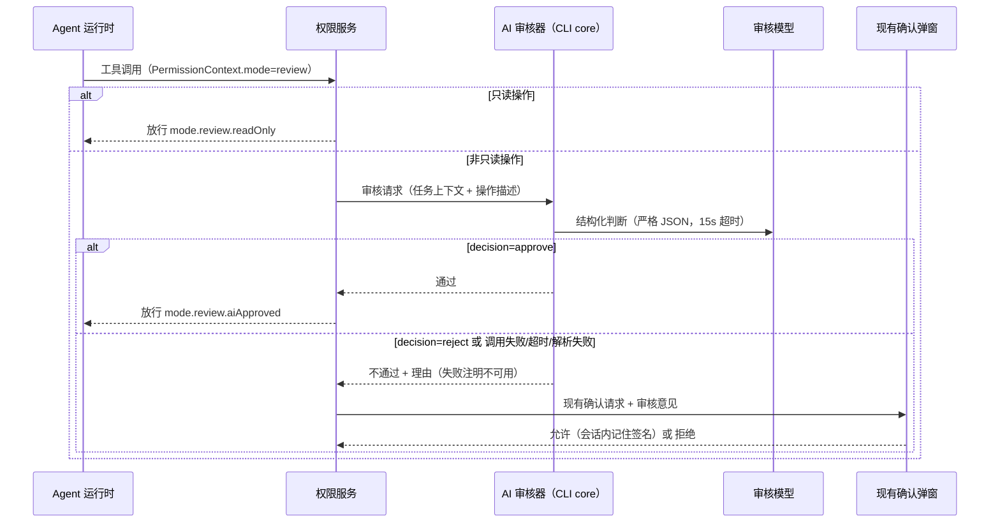

# 自动审核模式

## 模式语义（2026-10-03）

自动审核是第五档协作模式，内部值 `review`，界面文案「自动审核」（en: "Review automatically"）。语义为完全访问（yolo）基线之上，非只读的工具操作先经一次 AI 校验：校验通过直接执行；校验不通过、模型调用失败或超时，一律复用现有权限确认链路（与 build 模式「变更前确认」相同的弹窗交互）暂停等待用户决定，确认请求携带 AI 审核意见（结论、理由、风险类型）。审核结果只收紧不放宽：AI 通过不减少任何原有确认，AI 不通过或不确定才升级为人工确认。

权限服务仍是工具调用裁决的唯一所有者；AI 审核器是权限裁决在 review 模式下的协作组件，不新增独立业务状态所有者。「非只读」判定以归一化 capability 的 `sideEffectScope === "none"` 为免审线，数据来自工具注册的权限元数据，属确定性判断，不调用模型；Bash 沿用现有命令级只读解析（`git status` 等纯读命令免审，写类命令进审核）。`WebFetch` 等声明 readOnly 但副作用域为 network/system 的操作计入审核范围。用户在确认弹窗选择允许后，同一操作签名（工具名 + 参数哈希）在本次会话内不再重复审核与询问；会话结束失效，不落盘。

第一版仅在交互会话提供该模式：composer 模式下拉、CLI `--mode` 与会话配置可携带；定时任务、闲时任务表单值域不加入，automation 链路收到 review 值按遗留 `autoEdit` 同路径降级为 build。

## 状态所有者与接口

- 模式枚举同步扩展七处：`zcodeSessionModeSchema`（legacy 协议）、`ZCodeTaskMode` 与其 zod schema、`submissionModeSchema`（v4）、`executionPermissionModeSchema` 与 `resolveExecutionState`、`CliPermissionMode` 与 `--mode` 校验、bootstrap `SWITCHABLE_MODES`、services `toZCodeMode`/`fromZCodeMode` 与 `sessionModeOptions` canonical 集合。
- 裁决分支：permission/service 新增 `checkReviewMode`，与 `checkEditMode` 并列。只读放行 rule `mode.review.readOnly`；审核通过放行 rule `mode.review.aiApproved`；审核不通过或不可用转为现有确认请求，rule `mode.review.aiRejected`，确认请求 payload 扩展可选审核意见字段。
- AI 审核器位于 CLI core 权限域：输入为任务上下文（任务标题/初始指令与最近对话摘要）和待执行操作的结构化描述（工具名、命令文本、目标路径、编辑摘要，均截断）；待审内容置于明确定界符内并声明为数据而非指令，防提示注入。输出严格 JSON：`decision`（approve/reject）、`reasons`、`riskType`（harmful/unrelated，可为空）；解析失败按不确定处理。
- 模型选择仿照标题生成 sidecar：会话配置可指定 `autoReview.modelSelection`（轻量模型优先），未配置时回退会话模型，并统一套用 `auxiliaryModelOptions`（最低推理档位与输出上限）。单次审核超时上限 15 秒；超时、网络失败、解析失败均视为不确定，转人工确认，不静默放行（fail-closed）。
- 持久化复用项目权限模式偏好（`saveProjectPermissionMode` 路径），仅扩展枚举值，不新增存储字段；会话重启恢复该模式。
- UI：composer 模式下拉新增一档与图标（沿用现有图标体系）、中英文 label 与 description；权限确认弹窗新增「AI 审核意见」展示区，仅在该请求携带意见时出现；审核进行中在工具调用状态中展示「AI 审核中」过渡态。

## 时序

## 验收场景

1. 模式下拉出现「自动审核」，可选中并随下一次提交生效；运行中切换命令实时生效；重启后按项目偏好恢复。
2. review 模式下只读工具（读文件、搜索、状态查看）不触发审核，直接执行。
3. 非只读工具触发审核：审核通过时直接执行、无弹窗；其余四种模式行为与现状一致（回归）。
4. 审核不通过：工具调用暂停，弹现有确认窗，展示 AI 理由与风险类型；允许后继续执行，拒绝后按现有拒绝路径取消。
5. 用户放行后，同签名操作在本会话内不再触发审核与弹窗；新会话重新审核。
6. 审核模型超时或失败：转确认窗并注明「审核不可用」，不静默放行；权限链路不因审核挂起超过超时上限。
7. 审核请求的待审参数置于定界符数据区；模型返回非约定 JSON 时按不确定处理。
8. automation、闲时任务表单不出现该模式；automation 链路收到 review 值降级为 build 且可观测。
9. 审核 prompt 与结果仅 debug 级日志，不含文件全文与敏感内容，生产不落盘。
10. 中英文文案齐全；确认弹窗仅在携带审核意见时显示该区块。

## 验证

先补权限裁决与审核器单测（模拟 provider / 模拟审核器），再实现；模式映射与 automation 降级用协议级测试覆盖。执行 `pnpm typecheck`、`pnpm lint`、`pnpm architecture:check --changed`；弹窗、过渡态与会话记忆的实机交互在隔离开发实例验证并记录。UI E2E 复用 `TID_CHAT_MODE_SELECT_*` 锚点。验证记录在本节追加，未执行的场景单独说明。
