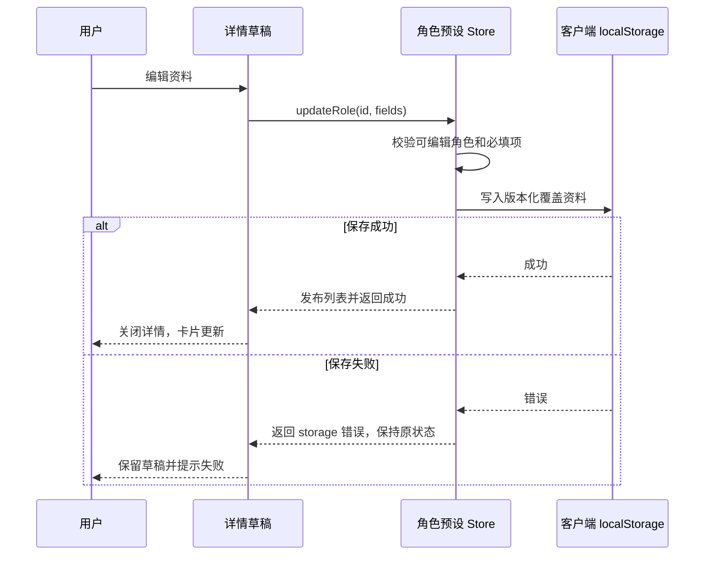
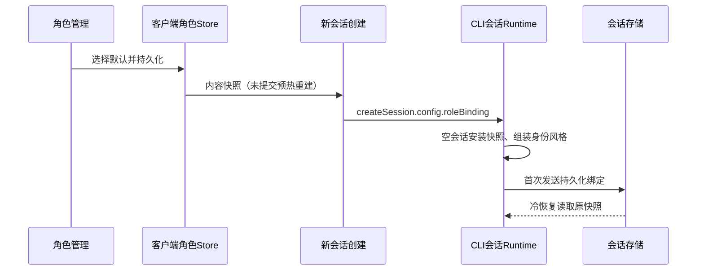
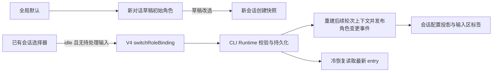

# 角色管理

## 产品规则

- 页面沿用插件市场的内容宽度和边距，按标题、说明与右侧操作、搜索框、带分隔线的“角色预设”分区排列。用户要求与插件市场一致：主标题复用其 text-2xl / lg:text-3xl 字号，其他字号沿用 text-ui 标记；搜索框直接复用 SettingsSearchInput，列表区采用 space-y-8，分区标题底部间距 pb-2，新建按钮采用市场主操作按钮样式。搜索在页面局部持有，按名称、来源和简介过滤，不修改 store；无匹配时展示空结果提示。

- 工作区侧栏在“插件市场”下方提供“角色管理”；独立主页面复用现有工作区导航历史。
- 官方角色固定为 `zcode-official`，固定首位，初始显示“当前默认”，详情名称和简介只读，可进入角色性格管理查看只读中文片段；不展示作者编辑字段。
- 提供 `general-assistant`（通用助手）和 `writing-partner`（写作伙伴）两个本地示例。卡片展示名称、作者来源、简介，点击打开详情弹窗。
- 示例详情可编辑名称和简介，并进入性格弹窗编辑人物身份与表达风格。名称及两项提示词必须非空。内层确认只更新详情草稿，外层保存统一提交；取消、关闭、Escape 按层丢弃草稿。
- 添加按钮打开创建表单，包含名称、简介、人物身份、表达风格。支持选择新对话默认角色，不支持删除、已有会话角色修改或跨客户端预设同步。
- 预设默认文本支持中英文；用户保存的文本保持原样，不随界面语言重写。

## 状态所有者与接口

- UI 内独立角色预设 Zustand store 是已保存资料的唯一所有者，通过 `useRolePresets` hook 暴露列表、载入状态、创建和更新操作。弹窗只拥有未保存草稿。
- `RolePreset` 包含稳定 id、builtin 标记、name、author、description、identityPrompt、expressionStylePrompt；`RolePresetFields` 是持久化资料。
- 更新入口校验 id、内置标记、名称和提示词。返回明确的失败类别；即使绕过界面也无法修改官方角色。
- 客户端 localStorage 使用版本化记录，只保存可编辑角色的覆盖资料，所有工作区共用。官方及示例默认值来自代码。首次页面访问载入一次，刷新或重启恢复。
- 保存顺序为校验 → 写入本地存储 → 发布 store 状态 → 关闭弹窗。写入失败不发布新状态，保留弹窗草稿并显示错误。
- 读取失败或数据格式不兼容时显示提示，保留代码定义的预设；不将读取失败写成成功恢复。
- 工作区导航由原有导航 store 持有，新增 `role-management` 历史条目，继续携带 workspaceIdentity 和 workspacePath。主视图选择仍由 App 持有；历史回放不重新入栈。
- 不增加 Main、Host、Service、Agent、队列或协议业务状态。desktop-continuous 与 web-remote-replayable 链路均不改变。

## 验收场景

1. 标题、说明／操作、搜索、分区列表顺序正确；搜索过滤与清空恢复正确，手机无横向溢出。初始三张卡片及来源正确，官方固定首位，默认标记跟随当前选择；添加按钮可用。
2. 官方字段只读，直接调用更新接口也失败。
3. 示例保存成功后卡片、重开详情及重新载入的数据一致；切换工作区仍使用同一列表。
4. 取消、关闭和 Escape 不提交草稿；空白名称或两项性格提示词不能保存。详情无作者编辑字段，通过性格入口编辑两项提示词。
5. 写入失败保留旧卡片及编辑草稿；读取失败显示提示，不静默声称恢复。
6. 聊天、插件市场、角色页面的前进后退正确，连续打开同页去重；相同路径的不同 workspaceIdentity 不合并。
7. 宽屏多列、手机单列；弹窗可滚动，无横向溢出；键盘可打开关闭且焦点回到卡片。浅色、深色和中英文均可用。

## 验证

先添加 store 与导航行为测试，再实现。使用仓库现有 Node test + tsx 执行新增测试；通过实际浏览器自动化验证共享 UI 与导航。执行 typecheck、lint、fmt:check 和 architecture:check --changed，环境限制与未执行场景单独记录。

### 可执行入口

- 状态与导航：`node node_modules/tsx/dist/cli.mjs --test packages/ui/test/roleManagement.test.ts`。
- UI E2E：设置 `ZCODE_ROLE_E2E_CDP` 指向已启动的隔离 Desktop CDP 地址（默认 http://127.0.0.1:9229），再运行 `node --test packages/ui/test/roleManagement.e2e.mjs`；可用 `ZCODE_ROLE_E2E_ARTIFACT_DIR` 指定截图目录。
- E2E 只使用测试客户端本地存储，主动模拟写入失败，并验证恢复、嵌套草稿、官方只读、导航及宽屏／手机主题布局。测试会暂时替换角色资料并在 finally 恢复，需使用隔离实例。
- 读取本地设置和数据的测试宿主需同时配置 `ZCODE_DESKTOP_HOME_DIR` 和 `ZCODE_DATA_BASE_DIR`。本次测试采用空 Provider 目录，不调用实际模型。

### 首版历史验证记录

- 状态／导航测试 7 项通过；共享 Web UI 的真实浏览器 E2E 通过，覆盖 1360×900 和 390×844 两种尺寸、浅色／深色及英文页面。
- 校验发现 Web 收起侧栏后顶部导航浮层会覆盖角色标题，已在角色页面布局预留高度，并补充位置断言。
- TypeScript、Lint、架构检查通过；Lint 有 70 条既有警告。本次改动的格式检查通过；全仓库格式检查仍有大量问题，未批量修改无关文件。
- 默认 `pnpm typecheck`、`pnpm lint` 因下载指定 pnpm 失败未能启动；使用 `pnpm --config.verify-deps-before-run=false --pm-on-fail=ignore` 执行相同脚本通过。验证环境为已安装的 Node 24.18.0 / pnpm 11.14.0，与 mise 指定版本存在差异。
- 验证的是共享 UI 的浏览器运行态；没有启动原生 Electron 或真实手机 attachment，不声称覆盖原生宿主或流式重连。
- 当前 feature-boundary 种子图尚未收录角色管理，视为 graph-drift-candidate；角色状态所有者和导航边界以本 spec 和当前源码为准。

## 添加与性格配置（2026-09-30）

新增角色支持名称、简介、人物身份、表达风格，后三项中名称与两项提示词必填。官方中文参考模板由 UI 代码独立定义，不改动运行时。官方配置可查看复制，只读，提示“Zcode官方默认角色，无法修改，仅供参考”。

详情草稿唯一持有本次未保存修改；内层性格草稿确认后回到详情，外层保存统一提交，取消外层丢弃全部。Escape 仅关闭顶层，焦点返回入口。添加成功清空搜索，新角色 UUID、来源本地自建，追加排序。

Store 唯一持有 overrides，增加 createRole；v2 overrides 包含两个提示词，自建角色允许 UUID，官方与未知非 UUID ID 不恢复。读取 v1 将 prompt 原文迁入 identityPrompt，补默认表达风格，写入 v2 后发布迁移状态，保留 v1。写入失败保留旧存储，显示失败；保存先持久化再发布。默认角色保持官方，不注入模型。

验收：创建刷新恢复、两项空白校验、内外层取消与焦点、只读官方与存储覆盖保护、v1 迁移及失败、桌面手机主题与长文本、导航回归。执行状态测试与 UI 自动化及类型/Lint/格式/架构检查。

### 添加与性格配置验证记录

- 状态、迁移、导航测试 9 项通过。实际隔离 Electron CDP E2E 通过，覆盖添加、默认模板对齐、官方只读、内外层取消、确认后统一保存、存储失败、刷新恢复、1360/390 宽度与浅深色主题、插件市场和聊天入口。截图已复核。
- typecheck 通过；Lint 70 条既有警告、0 错误；架构 0 违规；变更文件格式检查通过。运行时源码 apps/zcode-cli 无改动。
- 未执行真实手机 attachment、应用进程重启或真实模型验证；新 Store 恢复测试与刷新验证覆盖持久化恢复，不能等同于全部原生重启场景。英文文案已补充，本次 E2E 为中文界面。

## 全局默认角色生效（2026-09-30）

全局默认选择仅影响新建对话，不会覆盖已有会话。角色管理卡片详情提供“设为默认角色”；列表仅一个“当前默认”标记，官方恢复按钮走同一选择接口。默认选择持久化到当前客户端 v2 记录，存储失败保持原选择并提示。默认角色编辑只影响之后创建的对话；已有会话可在输入区显式切换到所选角色。

Renderer 的角色 Store 唯一持有默认选择。创建新会话时解析为不可变 RoleBinding 内容快照，经现有 createSession.config.roleBinding 传入 CLI/runtime。官方 binding 仅含 kind=official，不携带可覆盖文本；自定义包含 roleId/name/identityPrompt/expressionStylePrompt，严格 schema 校验。禁止将 UI 本地定义视为远端会话事实。会话角色 runtime 唯一持有，首次发送时与会话一起持久化 runtime/role_binding entry；冷恢复先读绑定再初始化上下文。fork 继承父会话快照；retry/compact 使用会话绑定。既有无绑定历史默认官方，不读最新客户端默认。

RoleBinding 通过独立运行时配置注入，不通过 Output Style 或 customSystemPrompt。创建时绑定和运行中切换共用严格 schema；自定义替换产品编程身份、身份介绍、可定制沟通风格；安全、Harness、进展说明、最终完整交付、代码规范、授权真实性、上下文连续性、Desktop、环境记忆技能等保持。官方 builder 未提供定制参数，输出原文及结构必须与重构前快照逐字相等。自定义与 workflow actor/customSystemPrompt 冲突时拒绝，不静默忽略。

预热是未提交草稿：默认选择、草稿改选或所选预设编辑变化触发未提升预热会话重建，首次提交前使用新的绑定；已提交会话仅在用户显式切换且空闲时更新，角色预设编辑不会静默回写其绑定。UI 在输入区显示草稿或会话当前角色。无需重启；默认变化影响新建对话，已有会话切换影响该会话的后续输入；手机远控继续使用既有 session runtime 与配置投影，不产生新 runtime。

验收：默认官方快照一致；自定义身份风格真正进入模型消息且核心保留；选择存储失败；新建、预热、冷恢复、fork、retry/compact稳定；选择官方后新会话无旧自定义；角色预设编辑不回写已有会话；桌面和手机投影不混淆。测试使用虚构提示词，日志不打印人物正文。

### 自定义角色身份前缀修订（2026-09-30）

自定义角色运行时不再注入包含 ZCode 产品身份的 CLI 前缀。Agent 的身份由会话绑定的 `identityPrompt` 承载；安全、Harness、工具与执行约束、环境信息、进展和最终回复要求继续按核心机制组装。官方角色原前缀保持逐字不变。用户自己填写或从旧模板保留的 ZCode 描述仍属于角色正文，由用户编辑角色时决定。

验收：自定义角色系统身份前缀不含 `ZCode` 或通用身份描述；角色 identityPrompt 原样注入；官方身份及提示词回归不变。

### 对话内角色选择（2026-09-30）

输入区工具栏把角色选择器放在模型选择器左侧。新建草稿默认读取全局默认角色；草稿中改选只覆盖该新会话，不改全局默认。已有对话显示本会话绑定，切换后立即更新本会话配置并保存稳定 role-binding entry；全局默认不受影响。角色更新由 CLI runtime 持有，通过严格的 V4 会话命令提交，事件更新 renderer 配置投影。历史消息和旧回复保留原样；新角色从切换后下一条输入开始生效，无需重启。

仅在会话空闲且没有已接纳待处理输入时允许切换。生成中或队列非空时禁用选择器并显示不可切换状态，避免模型请求或已接纳输入跨越角色边界。切换持有 runtime 准入屏障期间，新输入被拒绝并可重试，不会越过角色更新。无变化选择返回 noop；持久化失败保持旧角色与旧提示词。冷恢复从最新 role-binding entry 读取；fork 沿用其现有快照继承语义。

验收：工具栏顺序与当前角色一致；草稿改选不改全局默认；已有会话改选持久化且只作用于后续输入；busy/queue guard、同值 noop、无效 binding 及存储失败均不产生部分更新；重载后投影与 runtime 相同；模型选择和历史记录不受影响。

### 本轮验证记录（2026-09-30）

- 角色管理及切换测试共17项通过：含官方桌面/终端提示词逐字基线、实际 runtime 向模拟 provider 发出的请求与工具集合、创建 ACK 前绑定、持久化失败、冷恢复快照读取及严格协议校验。
- 隔离桌面客户端 UI E2E 通过：添加、嵌套编辑、默认切换、新任务角色标识、刷新恢复、官方只读、键盘、手机尺寸、浅深主题及长文本。测试结束恢复角色数据并将调试客户端默认设回官方。
- 根目录 `pnpm typecheck`、core/bootstrap 类型检查、`pnpm architecture:check --changed`（0违规）及变更文件格式检查通过。根目录 `pnpm lint` 通过，70项警告。
- core/bootstrap 单独 lint 未通过：现有超400行文件等规则失败，涉及 agent-runtime、resume、events、v4-bridge、product-projection 等已有大文件；未为本功能扩大范围拆解这些模块。
- Desktop 与 CLI 构建完成，隔离调试应用保持运行。运行时验证使用模拟 provider，未发送真实模型请求；完整进程冷启动恢复、fork/retry/compact 的端到端流程及手机远程链路未在本轮实际执行，相关实现复用会话快照路径。
- 草稿模式尚未就绪时仍传递角色快照，避免预热会话先按官方身份创建；默认变更仅影响未提交草稿及后续新会话。
