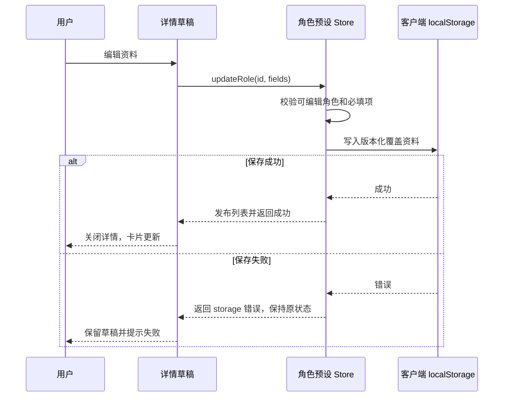
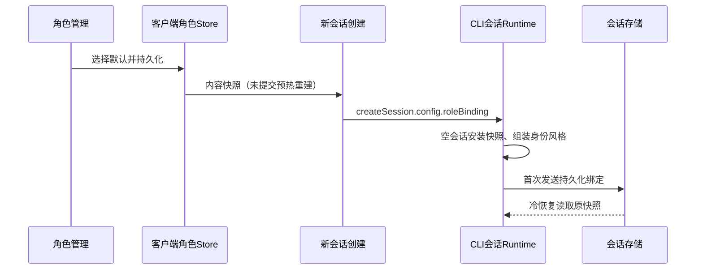
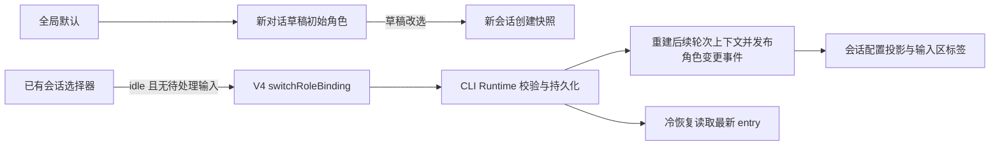

# 角色管理

## 版本预置 DexCode（2026-10-01）

角色默认定义由共享 UI 的 rolePresets 唯一提供，不依赖开发者 localStorage 或 artifacts。全新安装及空存储的 Desktop/Web 均按“ZCode 官方、DexCode”顺序显示两项；移除通用助手和写作伙伴的默认定义。中英文界面均使用同一提示词，简介提供英文翻译。

DexCode 保留现有稳定 ID `04a923fa-2db3-4a85-b456-8ffa17ef86a1`，使现有同 ID 本地覆盖优先且不重复显示；作为版本预置的可编辑角色，仍生成 custom RoleBinding，不使用仅代表官方运行时的 builtin 标记。默认角色仍为官方；用户选择 DexCode 后沿用现有先持久化再发布的路径，新会话获得冻结快照，已有会话不变。

旧示例 ID 的记录不再进入可选列表，默认指向旧示例时明确回退到官方，不能使其他 UUID 角色恢复失败。读取不会删除旧存储原文；后续显式保存仍写入当前有效角色。现有 DexCode 覆盖及其他自建角色保留，读取异常、未知默认 ID、存储失败语义不变。不增加状态所有者或协议。

### 预置内容第二版（2026-10-02）

DexCode 预置内容更新为用户在开发实例中手动调整并实测的第二版提示词：身份与表达风格改为英文（界面语言不影响提示词语言），高级覆盖从 progress/finalReply 两项扩展为 progress/finalReply/desktop/projectInstructions 四项。desktop 覆写携带 `# DexCode Desktop Context` 品牌标题；projectInstructions 覆写新增“输出风格与格式规则严格遵循默认行为”的约束；finalReply 采用自然对话式表达的编号清单。中文简介修正“带来了”“减少了”两处笔误，finalReply 清单修正重复的"5."编号；英文简介同步第二版描述。同 ID 本地覆盖仍优先，老用户不受影响，新安装读到第二版内容。

验收补充：空存储下身份提示词匹配 `You are DexCode`，高级覆盖键为 desktop/finalReply/progress/projectInstructions 四项，E2E 的身份与高级覆盖断言随第二版文案同步。

验收：空存储两种语言均包含 DexCode 且没有旧示例；完整提示词进入 custom 快照且不可变；预置角色可编辑、默认选择刷新恢复；现有同 ID 覆盖不重复；旧示例默认回退且其他自建资料保留。UI E2E 从空角色存储验证两张卡片、DexCode 默认选择及刷新恢复，并在 finally 恢复原资料。执行状态/运行时测试、typecheck、lint 和架构检查；未制作安装包时不声称已安装验证。

验证记录：状态及运行时测试 26 项通过；`node --test packages/ui/test/rolePresetShipping.e2e.mjs` 通过，从运行中的开发客户端暂时清空角色存储，确认两张预置卡片、身份及高级覆盖、默认选择和刷新恢复，并恢复用户原记录。`pnpm typecheck` 通过；`pnpm lint` 0 错误、71 条警告；架构检查 0 违规；本次文件格式检查通过。完整 `roleManagement.e2e.mjs` 回归在长文本性格窗口确认按钮的 850px 视口位置断言失败，未将完整响应式回归计为通过，也未确认失败归因。未制作或安装发行包，发布包携带预设由共享 UI 源码定义保证；未新增真实模型测试。执行环境 Node 24.18.0，与 mise 固定的 24.14.0 有差异。

第二版验证记录（2026-10-02）：roleManagement/roleSwitching/roleAdvanced 单测 26 项通过；`rolePresetShipping.e2e.mjs` 通过（断言已同步第二版文案：身份 `You are DexCode`、四项高级覆盖、advanced-count 4），E2E 前后用户本地覆盖与默认选择完整保留；`pnpm typecheck`、`pnpm lint`（0 错误）、`pnpm architecture:check --changed` 通过。未制作发行包；安装包携带第二版内容由 `rolePresets.ts` 源码定义保证，下次 `pnpm bundle:dexcode` 生效。

### 预置内容第三版与过时覆盖升级（2026-10-02）

DexCode 预置内容更新为用户在隔离开发实例（test 后端）中手动调整并实测的第三版提示词，覆盖记录经 CDP 从运行实例导出后固化。相对第二版变化集中在四项：`identityPrompt` 改为面向新手开发者的 development assistant 定位（proactive、clear well-structured communication）；`expressionStylePrompt` 重写为分级策略（简单问题简短直接、复杂问题先高层概览并按新手开发者对待）并引入回复前自检段落；progress 覆写简化为固定文案格式（首句说明意图，文案严格遵循"调用工具:[核心目的简介，无需描述技术细节]"）；finalReply 覆写从编号清单改为自然语言多段规则（列表仅用于总结性概览及条目格式、对比用表格且前后说明、概念架构可用 Mermaid、禁用「」角引号与箭头符号、控制信息密度、教学式口吻）。`desktop`、`projectInstructions` 覆写与简介、名称、温度（未设置）与第二版一致。中英文界面共用同一提示词，英文简介沿用第二版翻译。

过时覆盖升级规则（新增读取行为，回应"预置更新必须能到达已保存过旧预置的客户端"）：本地覆盖若与任一历史预置原文（含 zh/en 简介）逐字段完全一致，视为仅保存过旧版预置而非真正定制，`listRolePresets` 读取时忽略该覆盖并采用最新预置；只要覆盖任一字段与所有历史原文不同（包括设置了温度），即视为用户定制并继续覆盖优先。历史预置原文由源码维护（第一、二版），随版本追加。读取不删除旧存储原文、不回写存储、不新增状态所有者、不改 v3 存储格式与协议；官方 builtin 角色不参与。展示列表、详情/性格编辑初始值、默认角色绑定与对话内选择器绑定均经 `listRolePresets` 合并，升级后统一读到新预置；用户基于新预置再次编辑保存将产生新覆盖。依据：实测已安装 DexCode 客户端的 v3 记录中存在与第二版原文一致的 DexCode 覆盖，若无此机制该类客户端升级后将继续使用旧提示词。

验收：空存储两种语言读到第三版（身份以 `You are DexCode, the user's development assistant` 开头，progress 以 `Before your first tool call` 开头，finalReply 不再含第二版首句）；覆盖等于第一或第二版原文（zh 或 en）时两种 locale 均读到第三版预置；覆盖任一字段被真实修改（含设置温度）时保留覆盖；被忽略的覆盖不改变存储内容且 `selectedRoleId` 指向 DexCode 仍有效；官方角色行为不变；E2E 身份与高级覆盖断言随第三版文案同步。

第三版验证记录（2026-10-02）：roleManagement/roleSwitching/roleAdvanced/composerRoleSelection 单测共 35 项通过，新增过时覆盖升级三用例（历史原文 zh/en 全量升级、真定制与温度保留、store 读取不改写存储）。覆盖原文经 CDP 从运行中的隔离开发实例导出（`.local-debug` 目录，不入库）。`pnpm typecheck` 通过；`pnpm lint` 0 错误、69 条既有警告；`pnpm architecture:check --changed` 0 违规；变更文件 oxfmt 检查通过。`rolePresetShipping.e2e.mjs` 断言已同步第三版文案（progress `Before your first tool call`、finalReply `talking to a real person`），但本轮未执行通过：隔离调试实例重启后处于登录页（该实例从未保存登录凭据，属预期行为），角色管理入口不可达，未绕过登录门禁强跑。已安装 DexCode 客户端的 v3 记录经只读检查确认存在与第二版原文一致的 DexCode 覆盖，为升级规则的直接依据。未制作发行包；安装包携带第三版内容由 `rolePresets.ts` 源码定义保证，下次 `pnpm bundle:dexcode` 生效。执行环境 Node 24.18.0，与 mise 固定的 24.14.0 有差异。

## 高级提示词配置（2026-10-01）

高级英文提示词的标题旁提供小问号，悬浮或键盘聚焦显示对应官方默认片段的完整中文译文。官方与自建角色均可查看；参考译文固定为中文，不随角色覆盖或界面语言改写。长译文支持滚动，在手机视口内不溢出。中文参考仅属于 UI 展示，不注入模型、不持久化到角色资料；UI 按共享片段 ID 维护对应译文，复用现有 Tooltip。验收包括十二项内容对应、悬浮与焦点查看、长文本及小屏布局，以及自定义内容不改变默认参考。

中文参考 UI E2E：`node --test packages/ui/test/rolePromptReference.e2e.mjs` 通过，实际验证十二项悬浮、键盘聚焦、Escape 仅关闭提示层、390px 视口边界及长译文滚轮滚动。提示层挂载到当前 Dialog 内，避免被弹窗滚动锁拦截；测试只查看官方资料，不写入角色存储。当前运行的手动调试客户端通过热更新展示新功能。

性格窗口直接展示人物身份和表达风格，其余主会话固定规则放在默认收起的“高级配置”中。新增代码编写、代码注释、进展说明、最终交付、授权及结果报告、安全说明、Harness、上下文管理、桌面展示、技能指导、记忆维护、项目指令遵循共十二项独立文本框，展示运行时原文及中英文用途说明。前两项可直接编辑，其余默认只读且可复制。高级入口显示自定义项数，折叠不丢弃草稿，非法高级字段自动展开并聚焦。

解锁必须逐项经过 AlertDialog 确认，说明“修改该提示词可能影响 ZCode 的工作效果，请谨慎修改”及具体风险，默认聚焦取消。解锁仅在当前窗口有效，重开重新锁定。恢复默认删除覆盖，也须先解锁。官方界面布局一致，所有字段只读，无解锁和恢复入口。解锁不改变实际权限或工具能力。

详情草稿唯一持有未保存资料，性格窗口持有局部草稿、折叠及临时解锁状态；内层确认仅更新外层草稿，外层保存统一提交。Escape 只关闭顶层警告／性格／详情，关闭返回对应触发按钮。添加表单仍只有原基础字段。

共享公开契约定义十二个片段 ID、官方原文、锁定等级及严格的可选 promptOverrides；RolePresetFields 和 custom RoleBinding 携带稀疏覆盖。键未知、值非字符串或空白均拒绝；默认原文不保存为覆盖。official binding 不允许任何替换字段，角色库读取和更新不能覆盖官方 ID。默认原文统一从共享目录读取，提取后官方提示词内容、空白、顺序及消息结构须与基线逐字相等。主会话只在原位置覆盖，子代理和 workflow、Output Style、内部摘要不参与。

Store 仍是已保存预设唯一所有者，本地存储 v3；读取优先 v3→v2→v1，迁移保留 ID、字段、顺序和默认角色，成功写 v3 后发布状态，旧记录保留。读取／迁移失败不允许空状态覆盖原资料。保存先存储后发布，失败保留草稿。原有 v1 prompt 原文继续迁入 identityPrompt。

新建和显式会话切换共用快照解析入口，覆盖值复制并冻结。编辑预设不回写已有会话，busy／queued guard、准入屏障、持久化失败保持旧绑定、冷恢复和 fork 继承路径不改变。Desktop 连续投影与手机恢复投影通过同一 RoleBinding schema 传播，Main／Host 不增加角色业务所有者。桌面、技能、记忆、项目指导保留原条件；路径、环境事实、技能清单、工具定义、项目文件正文及状态提醒不作为覆盖项。

验收覆盖默认折叠、覆盖计数、展开／收起保留草稿、隐藏非法字段定位、逐项解锁／取消／重开锁定／恢复默认、三层 Escape 与焦点、官方只读、嵌套草稿及存储失败、v1/v2迁移及旧记录保留、严格 schema、每项运行时替换和条件注入、官方两种表面逐字基线、不可变绑定、切换／冷恢复／fork。隔离客户端 UI E2E 验证桌面／手机尺寸、主题、长文本与导航；执行相关状态／运行时测试、typecheck、lint、格式和架构检查，实际远控或真实模型未验证时单独说明。

### 高级配置验证记录（2026-10-01）

- `node node_modules/tsx/dist/cli.mjs --test packages/ui/test/roleManagement.test.ts packages/ui/test/roleSwitching.test.ts packages/ui/test/roleAdvanced.test.ts`：24 项通过。包含十二个片段的原位置替换、条件注入、官方桌面／终端逐字基线、严格 schema、不可变快照、v1/v2 迁移与失败保留、切换准入／幂等／持久化原子性、冷恢复，以及模拟 provider 实际收到的请求和工具集合。
- `node --test packages/ui/test/roleManagement.e2e.mjs`：1 项通过，使用独立数据目录的 Electron CDP 客户端。覆盖 1360／390 宽度、浅深色、中英文、长文本、官方只读和复制、默认折叠与计数、隐藏错误定位、逐项解锁／默认取消焦点／Escape／焦点恢复、重新锁定、恢复默认、嵌套草稿、保存失败、刷新恢复、插件市场和新聊天导航。测试结束恢复原有角色记录及界面语言；截图保存在仓库外的隔离验证目录。
- 根目录 `pnpm typecheck`、core 类型检查通过。`pnpm lint` 通过，0 错误、70 项既有警告；`pnpm architecture:check --changed` 通过，0 违规。
- 变更文件分别使用根目录和 CLI 所属 formatter 检查，均通过；`git diff --check` 通过。全仓库 `pnpm fmt:check` 未通过，报告 2826 个格式问题，未扩大范围格式化无关文件。
- 未调用真实模型；未实际验证完整进程重启、fork/retry/compact 的端到端流程或手机远控 attachment。冷恢复由会话快照测试覆盖，手机验证为响应式视口；相关链路继续复用现有 RoleBinding 契约。

## 产品规则

- 页面沿用插件市场的内容宽度和边距，按标题、说明与右侧操作、搜索框、带分隔线的“角色预设”分区排列。用户要求与插件市场一致：主标题复用其 text-2xl / lg:text-3xl 字号，其他字号沿用 text-ui 标记；搜索框直接复用 SettingsSearchInput，列表区采用 space-y-8，分区标题底部间距 pb-2，新建按钮采用市场主操作按钮样式。搜索在页面局部持有，按名称、来源和简介过滤，不修改 store；无匹配时展示空结果提示。

- 工作区侧栏在“插件市场”下方提供“角色管理”；独立主页面复用现有工作区导航历史。
- 官方角色固定为 `zcode-official`，固定首位，初始显示“当前默认”，详情名称和简介只读，可进入角色性格管理查看只读中文片段；不展示作者编辑字段。
- 提供 DexCode 作为版本预置的可编辑角色。卡片展示名称、作者来源、简介，点击打开详情弹窗。
- 示例详情可编辑名称和简介，并进入性格弹窗编辑人物身份与表达风格。名称及两项提示词必须非空。内层确认只更新详情草稿，外层保存统一提交；取消、关闭、Escape 按层丢弃草稿。
- 添加按钮打开创建表单，包含名称、简介、人物身份、表达风格。支持选择新对话默认角色，不支持删除、已有会话角色修改或跨客户端预设同步。
- 预设默认文本支持中英文；用户保存的文本保持原样，不随界面语言重写。

## 状态所有者与接口

- UI 内独立角色预设 Zustand store 是已保存资料的唯一所有者，通过 `useRolePresets` hook 暴露列表、载入状态、创建和更新操作。弹窗只拥有未保存草稿。
- `RolePreset` 包含稳定 id、builtin 标记、name、author、description、identityPrompt、expressionStylePrompt；`RolePresetFields` 是持久化资料。
- 更新入口校验 id、内置标记、名称和提示词。返回明确的失败类别；即使绕过界面也无法修改官方角色。
- 客户端 localStorage 使用版本化记录，只保存可编辑角色的覆盖资料，所有工作区共用。官方及 DexCode 默认值来自代码。首次页面访问载入一次，刷新或重启恢复。
- 保存顺序为校验 → 写入本地存储 → 发布 store 状态 → 关闭弹窗。写入失败不发布新状态，保留弹窗草稿并显示错误。
- 读取失败或数据格式不兼容时显示提示，保留代码定义的预设；不将读取失败写成成功恢复。
- 工作区导航由原有导航 store 持有，新增 `role-management` 历史条目，继续携带 workspaceIdentity 和 workspacePath。主视图选择仍由 App 持有；历史回放不重新入栈。
- 不增加 Main、Host、Service、Agent、队列或协议业务状态。desktop-continuous 与 web-remote-replayable 链路均不改变。

## 验收场景

1. 标题、说明／操作、搜索、分区列表顺序正确；搜索过滤与清空恢复正确，手机无横向溢出。初始两张卡片及来源正确，官方固定首位，默认标记跟随当前选择；添加按钮可用。
2. 官方字段只读，直接调用更新接口也失败。
3. 示例保存成功后卡片、重开详情及重新载入的数据一致；切换工作区仍使用同一列表。
4. 取消、关闭和 Escape 不提交草稿；空白名称或两项性格提示词不能保存。详情无作者编辑字段，通过性格入口编辑两项提示词。
5. 写入失败保留旧卡片及编辑草稿；读取失败显示提示，不静默声称恢复。
6. 聊天、插件市场、角色页面的前进后退正确，连续打开同页去重；相同路径的不同 workspaceIdentity 不合并。
7. 宽屏多列、手机单列；弹窗可滚动，无横向溢出；键盘可打开关闭且焦点回到卡片。浅色、深色和中英文均可用。

## 验证

先添加 store 与导航行为测试，再实现。使用仓库现有 Node test + tsx 执行新增测试；通过实际浏览器自动化验证共享 UI 与导航。执行 typecheck、lint、fmt:check 和 architecture:check --changed，环境限制与未执行场景单独记录。

### 可执行入口

- 状态与导航：`node node_modules/tsx/dist/cli.mjs --test packages/ui/test/roleManagement.test.ts`。
- UI E2E：设置 `ZCODE_ROLE_E2E_CDP` 指向已启动的隔离 Desktop CDP 地址（默认 http://127.0.0.1:9229），再运行 `node --test packages/ui/test/roleManagement.e2e.mjs`；可用 `ZCODE_ROLE_E2E_ARTIFACT_DIR` 指定截图目录。
- E2E 只使用测试客户端本地存储，主动模拟写入失败，并验证恢复、嵌套草稿、官方只读、导航及宽屏／手机主题布局。测试会暂时替换角色资料并在 finally 恢复，需使用隔离实例。
- 读取本地设置和数据的测试宿主需同时配置 `ZCODE_DESKTOP_HOME_DIR` 和 `ZCODE_DATA_BASE_DIR`。本次测试采用空 Provider 目录，不调用实际模型。

### 首版历史验证记录

- 状态／导航测试 7 项通过；共享 Web UI 的真实浏览器 E2E 通过，覆盖 1360×900 和 390×844 两种尺寸、浅色／深色及英文页面。
- 校验发现 Web 收起侧栏后顶部导航浮层会覆盖角色标题，已在角色页面布局预留高度，并补充位置断言。
- TypeScript、Lint、架构检查通过；Lint 有 70 条既有警告。本次改动的格式检查通过；全仓库格式检查仍有大量问题，未批量修改无关文件。
- 默认 `pnpm typecheck`、`pnpm lint` 因下载指定 pnpm 失败未能启动；使用 `pnpm --config.verify-deps-before-run=false --pm-on-fail=ignore` 执行相同脚本通过。验证环境为已安装的 Node 24.18.0 / pnpm 11.14.0，与 mise 指定版本存在差异。
- 验证的是共享 UI 的浏览器运行态；没有启动原生 Electron 或真实手机 attachment，不声称覆盖原生宿主或流式重连。
- 当前 feature-boundary 种子图尚未收录角色管理，视为 graph-drift-candidate；角色状态所有者和导航边界以本 spec 和当前源码为准。

## 添加与性格配置（2026-09-30）

新增角色支持名称、简介、人物身份、表达风格，后三项中名称与两项提示词必填。官方中文参考模板由 UI 代码独立定义，不改动运行时。官方配置可查看复制，只读，提示“Zcode官方默认角色，无法修改，仅供参考”。

详情草稿唯一持有本次未保存修改；内层性格草稿确认后回到详情，外层保存统一提交，取消外层丢弃全部。Escape 仅关闭顶层，焦点返回入口。添加成功清空搜索，新角色 UUID、来源本地自建，追加排序。

Store 唯一持有 overrides，增加 createRole；v2 overrides 包含两个提示词，自建角色允许 UUID，官方与未知非 UUID ID 不恢复。读取 v1 将 prompt 原文迁入 identityPrompt，补默认表达风格，写入 v2 后发布迁移状态，保留 v1。写入失败保留旧存储，显示失败；保存先持久化再发布。默认角色保持官方，不注入模型。

验收：创建刷新恢复、两项空白校验、内外层取消与焦点、只读官方与存储覆盖保护、v1 迁移及失败、桌面手机主题与长文本、导航回归。执行状态测试与 UI 自动化及类型/Lint/格式/架构检查。

### 添加与性格配置验证记录

- 状态、迁移、导航测试 9 项通过。实际隔离 Electron CDP E2E 通过，覆盖添加、默认模板对齐、官方只读、内外层取消、确认后统一保存、存储失败、刷新恢复、1360/390 宽度与浅深色主题、插件市场和聊天入口。截图已复核。
- typecheck 通过；Lint 70 条既有警告、0 错误；架构 0 违规；变更文件格式检查通过。运行时源码 apps/zcode-cli 无改动。
- 未执行真实手机 attachment、应用进程重启或真实模型验证；新 Store 恢复测试与刷新验证覆盖持久化恢复，不能等同于全部原生重启场景。英文文案已补充，本次 E2E 为中文界面。

## 全局默认角色生效（2026-09-30）

全局默认选择仅影响新建对话，不会覆盖已有会话。角色管理卡片详情提供“设为默认角色”；列表仅一个“当前默认”标记，官方恢复按钮走同一选择接口。默认选择持久化到当前客户端 v2 记录，存储失败保持原选择并提示。默认角色编辑只影响之后创建的对话；已有会话可在输入区显式切换到所选角色。

Renderer 的角色 Store 唯一持有默认选择。创建新会话时解析为不可变 RoleBinding 内容快照，经现有 createSession.config.roleBinding 传入 CLI/runtime。官方 binding 仅含 kind=official，不携带可覆盖文本；自定义包含 roleId/name/identityPrompt/expressionStylePrompt，严格 schema 校验。禁止将 UI 本地定义视为远端会话事实。会话角色 runtime 唯一持有，首次发送时与会话一起持久化 runtime/role_binding entry；冷恢复先读绑定再初始化上下文。fork 继承父会话快照；retry/compact 使用会话绑定。既有无绑定历史默认官方，不读最新客户端默认。

RoleBinding 通过独立运行时配置注入，不通过 Output Style 或 customSystemPrompt。创建时绑定和运行中切换共用严格 schema；自定义替换产品编程身份、身份介绍、可定制沟通风格；安全、Harness、进展说明、最终完整交付、代码规范、授权真实性、上下文连续性、Desktop、环境记忆技能等保持。官方 builder 未提供定制参数，输出原文及结构必须与重构前快照逐字相等。自定义与 workflow actor/customSystemPrompt 冲突时拒绝，不静默忽略。

预热是未提交草稿：默认选择、草稿改选或所选预设编辑变化触发未提升预热会话重建，首次提交前使用新的绑定；已提交会话仅在用户显式切换且空闲时更新，角色预设编辑不会静默回写其绑定。UI 在输入区显示草稿或会话当前角色。无需重启；默认变化影响新建对话，已有会话切换影响该会话的后续输入；手机远控继续使用既有 session runtime 与配置投影，不产生新 runtime。

验收：默认官方快照一致；自定义身份风格真正进入模型消息且核心保留；选择存储失败；新建、预热、冷恢复、fork、retry/compact稳定；选择官方后新会话无旧自定义；角色预设编辑不回写已有会话；桌面和手机投影不混淆。测试使用虚构提示词，日志不打印人物正文。

### 自定义角色身份前缀修订（2026-09-30）

自定义角色运行时不再注入包含 ZCode 产品身份的 CLI 前缀。Agent 的身份由会话绑定的 `identityPrompt` 承载；安全、Harness、工具与执行约束、环境信息、进展和最终回复要求继续按核心机制组装。官方角色原前缀保持逐字不变。用户自己填写或从旧模板保留的 ZCode 描述仍属于角色正文，由用户编辑角色时决定。

验收：自定义角色系统身份前缀不含 `ZCode` 或通用身份描述；角色 identityPrompt 原样注入；官方身份及提示词回归不变。

### 对话内角色选择（2026-09-30）

输入区工具栏把角色选择器放在模型选择器左侧。新建草稿默认读取全局默认角色；草稿中改选只覆盖该新会话，不改全局默认。已有对话显示本会话绑定，切换后立即更新本会话配置并保存稳定 role-binding entry；全局默认不受影响。角色更新由 CLI runtime 持有，通过严格的 V4 会话命令提交，事件更新 renderer 配置投影。历史消息和旧回复保留原样；新角色从切换后下一条输入开始生效，无需重启。

仅在会话空闲且没有已接纳待处理输入时允许切换。生成中或队列非空时禁用选择器并显示不可切换状态，避免模型请求或已接纳输入跨越角色边界。切换持有 runtime 准入屏障期间，新输入被拒绝并可重试，不会越过角色更新。无变化选择返回 noop；持久化失败保持旧角色与旧提示词。冷恢复从最新 role-binding entry 读取；fork 沿用其现有快照继承语义。

验收：工具栏顺序与当前角色一致；草稿改选不改全局默认；已有会话改选持久化且只作用于后续输入；busy/queue guard、同值 noop、无效 binding 及存储失败均不产生部分更新；重载后投影与 runtime 相同；模型选择和历史记录不受影响。

### 草稿选中态与官方角色（2026-10-02）

工具栏角色选中态是展示投影，从当前 binding 单向派生，不新增状态所有者：`custom` 取 `roleId`；`official` 固定显示 `zcode-official`；仅当草稿尚未携带 binding（从未选择）时才回退全局默认角色。已有会话无 binding 时同样显示官方。

背景缺陷：草稿态曾把显式选择的 `{ kind: "official" }` 与"尚未选择"混入同一回退分支，全局默认为自定义角色时，用户在新建任务中切回官方后下拉高亮仍停在默认角色——实际 binding 已切换成功，但显示与事实相反，会误导用户对生效角色的判断。

验收：默认角色为 DexCode 时，草稿显式选择官方后选中态为 `zcode-official`；未选择时仍显示默认角色；custom 选中态与已有会话行为不变。

验证记录（2026-10-02）：新增选中态投影单测 4 项通过（显式官方、未选择回退、custom 保持、已有会话官方回退）；roleManagement/roleSwitching/roleAdvanced 26 项回归通过；`pnpm typecheck`、`pnpm lint`（0 错误、70 条既有警告）、`pnpm architecture:check --changed`（0 违规）通过。选中态修复仅改展示投影，未触碰协议与 runtime；未新增 E2E，运行中的开发客户端需刷新或重启后生效。

### 角色模型温度（2026-10-02）

自定义角色可配置模型采样温度；角色绑定快照携带该值，仅在该会话的主对话模型请求中生效。官方角色与未配置温度的自定义角色不传该参数，维持服务端默认（此前行为）。

规则与边界：

- `RolePresetFields` 与 custom `RoleBinding` 新增可选 `temperature`，取值为 [0.1, 1] 的有限数字；缺省语义是“不设置”，模型请求体不带该字段。UI 表单提供 0.1–1、步进 0.1 的数字输入（隐藏输入框右侧的上下步进箭头，仅键盘与手输），可清空表示不设置，非法输入禁用「确认」。
- 温度编辑入口位于「角色性格管理 → 高级配置」内，与锁定提示词一致默认锁定：只读展示，点击「解锁编辑」并确认解锁警告后才能修改；提供「恢复默认」清空回未设置。官方角色在高级配置中保持只读，不出现解锁入口。主编辑对话框不再单独展示温度字段。
- 高级配置的「已自定义 N 项」计数把已设置的温度计入。
- 仅自定义角色（含 DexCode 覆盖）可编辑温度；官方角色只读，official binding 永远不带该字段。
- 生效范围限定主对话 turn：注入点是 `runModelTextRequest` 构造 `ModelRequest.options` 处，从 `config.roleBinding` 读取。compact、标题生成、subagent、websearch 等辅助模型调用不消费角色温度。
- 请求链路：`config.roleBinding.temperature` → `ModelRequest.options.temperature`（`ModelOptions` 扩展）→ adapter `toLegacyRequest` 映射 → `runner-options` 既有透传 → AI SDK；undefined 在 adapter 边界被移除，不进请求体。
- 快照语义沿用角色绑定：binding 是会话创建/切换时的快照，修改角色库不回写已有会话；流式恢复重试复用同一请求温度。
- 兼容性：localStorage v3 不升版本（字段可选，旧记录等同未配置）；旧 session entry 与旧客户端 binding 由 zod optional 兼容。取值范围在功能发布前由 [0, 2] 收窄为 [0.1, 1]：越界的旧调试温度在编辑器加载与绑定投影时按未配置处理（口径同 `rolePresetToBinding`）；带越界温度的旧调试 session entry 会使 binding 恢复抛错（不为此加兜底）。
- UI 文案：输入提示为「合法值 0.1-1 之间」；不再展示模型上限差异的长说明（收窄范围本身已规避主流模型上限问题）。

验收：自定义角色配置 0.1–1 内温度后，该角色会话的主对话模型请求 `options.temperature` 等于配置值；未配置或官方角色的请求不含该字段；小于 0.1、大于 1（含 0）、非数字被 `isRolePresetFields` 与 `roleBindingSchema` 拒绝；温度字段在高级配置中默认锁定，解锁前不可编辑；旧本地存储、旧 session entry 与旧协议 binding 解析后行为等同于未配置（越界温度除外，见兼容性）。

验证记录（2026-10-02）：roleManagement/roleSwitching/roleAdvanced/composerRoleSelection 共 32 项通过，新增温度用例覆盖字段校验与持久化恢复（roleManagement）及真实 runtime 向模拟 provider 发出的请求参数（roleSwitching：custom 带温度 `options.temperature` 为配置值，custom 未配置与 official 不含该字段）。`pnpm typecheck`、`pnpm lint`（0 错误、70 条既有警告）、`pnpm architecture:check --changed`（0 违规）通过。adapter 侧扩展了 `ModelExecutionRequest.options` 类型与 `validateOptions`（越界温度在请求前拒绝而非静默剔除）。UI E2E 未新增；运行中的开发客户端需刷新，Agent CLI 需重新构建后重启生效。

修订记录（2026-10-02 第二版）：取值范围收窄为 [0.1, 1]（含 UI、shared schema、adapter validateOptions 三处同步）；温度编辑从主编辑对话框移入「角色性格管理 → 高级配置」，默认锁定并走既有解锁警告流程，提供「恢复默认」清空；「已自定义 N 项」计数包含已设置的温度；输入框隐藏步进箭头，提示文案改为「合法值0.1-1之间」。温度块抽为 `RoleTemperatureField` 组件（RolePersonalityDialog 超 max-lines）。验证：roleManagement/roleSwitching/roleAdvanced 28 项 + composerRoleSelection 4 项（需 `--tsconfig packages/ui/tsconfig.json` 运行）通过；`pnpm typecheck`、`pnpm lint`（0 错误、69 条既有警告）、`pnpm architecture:check --changed`（0 违规）通过。附带清理：`V4ComposerToolbar.tsx` 中已提交的死参数 `isMobileViewport`（无调用方传参）与 core `auxiliary-model-options.ts` 的 `Required<ModelOptions>` 返回类型（新增 temperature 字段后被误强制必填）。

### 本轮验证记录（2026-09-30）

- 角色管理及切换测试共17项通过：含官方桌面/终端提示词逐字基线、实际 runtime 向模拟 provider 发出的请求与工具集合、创建 ACK 前绑定、持久化失败、冷恢复快照读取及严格协议校验。
- 隔离桌面客户端 UI E2E 通过：添加、嵌套编辑、默认切换、新任务角色标识、刷新恢复、官方只读、键盘、手机尺寸、浅深主题及长文本。测试结束恢复角色数据并将调试客户端默认设回官方。
- 根目录 `pnpm typecheck`、core/bootstrap 类型检查、`pnpm architecture:check --changed`（0违规）及变更文件格式检查通过。根目录 `pnpm lint` 通过，70项警告。
- core/bootstrap 单独 lint 未通过：现有超400行文件等规则失败，涉及 agent-runtime、resume、events、v4-bridge、product-projection 等已有大文件；未为本功能扩大范围拆解这些模块。
- Desktop 与 CLI 构建完成，隔离调试应用保持运行。运行时验证使用模拟 provider，未发送真实模型请求；完整进程冷启动恢复、fork/retry/compact 的端到端流程及手机远程链路未在本轮实际执行，相关实现复用会话快照路径。
- 草稿模式尚未就绪时仍传递角色快照，避免预热会话先按官方身份创建；默认变更仅影响未提交草稿及后续新会话。
